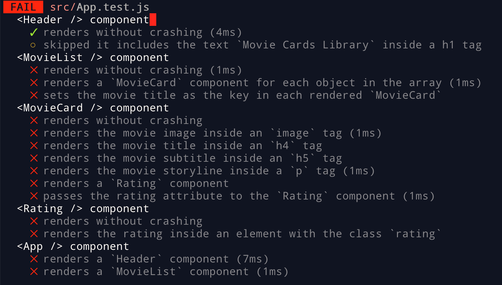

# Boas vindas ao Projeto Store Manager!
---

### Nesse projeto, irei:

- Entender o funcionamento da camada de Model;
- Delegar responsabilidades específicas para essa camada;
- Conectar sua aplicação com diferentes bancos de dados;
- Estruturar uma aplicação em camadas;
- Delegar responsabilidades específicas para cada parte do seu app;
- Melhorar manutenibilidade e reusabilidade do seu código;
- Entender e aplicar os padrões REST;
- Escrever assinaturas para APIs intuitivas e facilmente entendíveis.

---

## O que foi desenvolvido:

Uma API RESTful utilizando a arquitetura MSC!
A API construída trata-se de um sistema de gerenciamento de vendas, onde será possível criar, visualizar, deletar e atualizar produtos e vendas.

Desenvolvi todas as camadas da API (Models, Services caso necessário, e Controllers).

utilizei MongoDb como banco de dados.


## Antes de começar:

1. Clone o repositório

- Entre na pasta do repositório que você acabou de clonar:

2. Instale as dependências [**Caso existam**]

- `npm install`

Atenção :warning: Não rode o comando npm audit fix! Ele atualiza várias dependências do projeto, e essa atualização gera conflitos com o avaliador.

### Todos os seus endpoints estão no padrão REST

- Usei verbos HTTP adequados para cada operação.

- Agrupei e padronizei suas URL em cada recurso.

- Garanti que meus endpoints sempre retornem uma resposta, havendo sucesso nas operações ou não.

- Retornei os códigos de status corretos (recurso criado, erro de validação, autorização, etc).

### Conexão com o Banco:

A conexão do banco local deverá conter os seguintes parâmetros:

```javascript
const MONGO_DB_URL = 'mongodb://localhost:27017/StoreManager';
const DB_NAME = 'StoreManager';
```

Para o avaliador funcionar altere a conexão do banco para:

```javascript
const MONGO_DB_URL = 'mongodb://mongodb:27017/StoreManager';
const DB_NAME = 'StoreManager';
```

### Tabelas

O banco terá duas tabelas: produtos e vendas

A tabela de produtos deverá ter o seguinte nome: `products`

Os campos da tabela `products` terão esse formato:

```json
{ "name": "Produto Silva", "quantity": 10 }
```

A resposta do insert que deve retornar após a criação é parecida essa:

```json
{ "_id": ObjectId("5f43cbf4c45ff5104986e81d"), "name": "Produto Silva", "quantity": 10 }
```

(O \_id será gerado automaticamente)

A tabela de vendas deverá ter o seguinte nome: `sales`

Os campos da tabela `sales` terão esse formato:

```json
{ "itensSold": [{ "productId": "5f43cbf4c45ff5104986e81d", "quantity": 2 }] }
```

A resposta do insert que deve retornar após a criação é parecida essa:

```json
{
  "_id": ObjectId("5f43cc53c45ff5104986e81e"),
  "itensSold": [{ "productId": "5f43cbf4c45ff5104986e81d", "quantity": 2 }]
}
```

(O \_id será gerado automaticamente)

## Testes

Usaremos o [Jest]() e o [Frisby] para fazer os testes de api.

Este projeto já vem configurado e com suas dependências

Para poder executar os testes basta executar comando `npm test` e o resultado será igual o abaixo:


## Dica: desativando testes

Especialmente no início, quando a maioria dos testes está falhando, a saída após executar os testes é bastante poluída. Você pode desabilitar temporariamente um teste utilizando a função `skip` junto à função `it`. Como o nome indica, esta função "pula" um teste:

```js
it.skip('it includes the text `Movie Cards Library` inside a h1 tag', () => {
  wrapper = shallow(<Header />);

  expect(wrapper.find('header h1').text()).toBe('Movie Cards Library');
});
```

Na saída da execução dos testes, você verá um  indicando que o teste está sendo pulado:



Uma estratégia é pular todos os testes no início e ir implementando um teste de cada vez, removendo dele a função `skip`.
